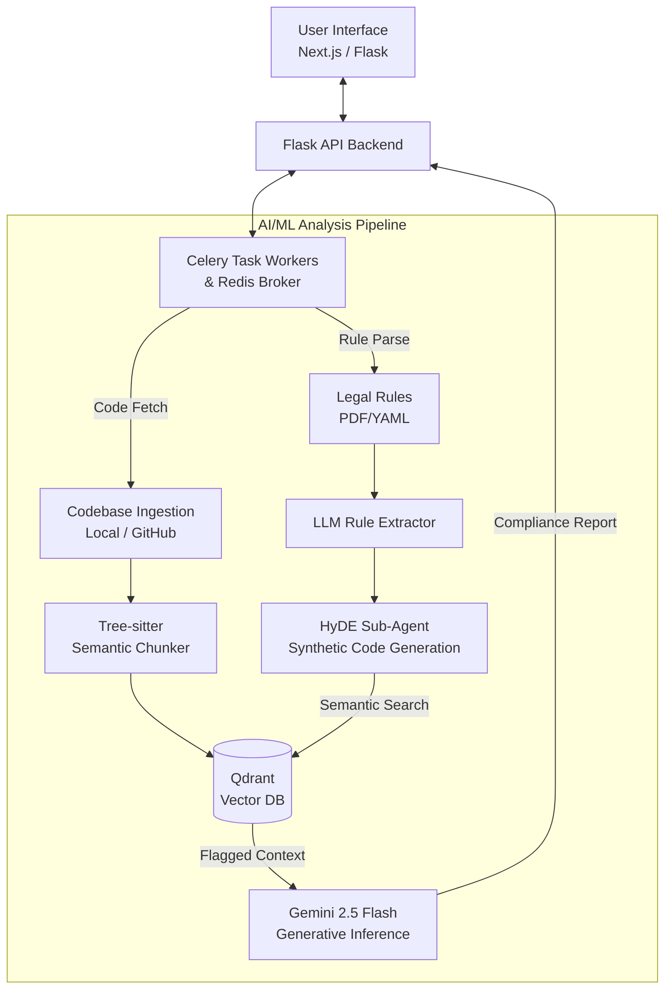

# Software Engineering Lab - Release 2 Project Proposal

## 1. OVERVIEW & PURPOSE
This document serves as the official submission guideline for Release 2 of the Software Engineering Lab project. We are proposing the development of an **AI-Powered Dataset Compliance Checker**. The project is designed to audit codebases and detect dataset license and usage violations using a combination of static analysis, Agentic RAG pipelines, and Google's Gemini 2.5 Flash model. This consolidated document covers the mandatory sections detailing our problem space, proposed solution, and technological approach.

## 2. PROBLEM STATEMENT
As open-source datasets and pre-trained models proliferate, developers often unknowingly violate complex licensing agreements and dataset usage constraints (e.g., restricted commercial use, prohibited generative training). 

Junior and senior developers alike spend countless hours manually cross-referencing legal texts with their codebase implementations. Existing static analysis tools and generic linters lack the semantic understanding required to map verbose, nuanced legal language to functional source code behavior. The absence of context-aware compliance tooling leaves a massive gap that exposes organizations to significant legal liability, copyright infringement, and ethical breaches when models are deployed or datasets are mishandled.

## 3. PROPOSED SOLUTION
We propose building an **AI-Powered Dataset Compliance Checker**, a sophisticated compliance scanning tool that bridges the gap between unstructured legal text and application source code.

**What we are building:**
- **Automated Rule Definition:** The system converts complex dataset licenses (via PDFs or YAML configuration) into structured constraints using an LLM-powered extraction pipeline to prevent the loss of legal nuance.
- **Multimodal Code Ingestion:** The tool analyzes local workspaces, uploaded ZIPs, or public GitHub repositories directly.
- **Advanced Agentic RAG Pipeline:** Our system bridges the semantic gap using Hypothetical Document Embeddings (HyDE). A sub-agent synthesizes hypothetical rule-violating code, which is then used to query the codebase vector embeddings for high-accuracy semantic matches.
- **AI-Driven Detection & Reporting:** The pipeline uses Gemini 2.5 Flash to evaluate the flagged snippets and output deterministic, line-by-line feedback explaining why a snippet violates the conditions.

**Why it is novel / better:**
Instead of traditional regex or generic token-matching, our solution translates legal jargon into code semantics and evaluates AST boundaries using Tree-sitter. This minimizes false positives and provides users with actionable remediation context rather than a simple boolean flag.

* **GitHub Repository:** [https://github.com/sahas42/software-tool](https://github.com/sahas42/software-tool) 
* Complete source code, features description, architecture, `requirements.txt`, setup steps, and comments are already included and actively maintained in the repository's `README.md` and codebase directories.

## 4. SYSTEM ARCHITECTURE
Our architecture adopts a containerized microservice design, split into three main layers:

- **Frontend Layer:** A modern Next.js web application for managing audits alongside a lightweight vanilla Flask-based UI fallback.
- **Backend API & Task Broker:** A Flask API gateway utilizing Celery and Redis. This layer orchestrates asynchronous analysis jobs, ensuring the web client remains unblocked during heavy inference.
- **AI/ML Analysis Pipeline:** The core engine utilizing Tree-sitter for semantic code chunking. Extracted chunks are stored in a local Qdrant Vector database. The pipeline leverages a HyDE (Hypothetical Document Embeddings) sub-agent and Google Gemini 2.5 Flash for the final structured generative inference.

**System Layout Diagram:**

## 5. TECH STACK
- **Frontend:** Next.js (React) for the rich, modern web interface; vanilla HTML/CSS/JS for the lightweight UI fallback.
- **Backend:** Python alongside the Flask framework serving as the REST API gateway and orchestrator.
- **Task Scheduling / Concurrency:** Celery for asynchronous background task execution, backed by Redis acting as the message broker.
- **Database (Vector Store):** Qdrant (deployed locally via Docker) for robust indexing and semantic search over code embeddings.
- **AI / ML:** Google Gemini 2.5 Flash via API (for extraction, reasoning, and context-aware static code analysis); Tree-sitter for semantic abstract syntax tree (AST) codebase chunking; Jina/BGE equivalent variants for text embedding.
- **DevOps / Collaboration:** Docker and Docker Compose for infrastructure orchestration and seamless local provisioning; Git/GitHub for version control.

## 6. TEAM ROLES

*Clearly define the role and responsibilities of each team member. Every member must have a distinct, meaningful contribution to the project. Generic or overlapping roles are not acceptable. Each member must also list the specific tasks they personally completed for Release 1 — not just their role title. Contributions must be verifiable through GitHub commits or task logs.*

- **Member Name:** [Insert Name 1]
  - **Role Title:** [Insert Role]
  - **Specific Responsibilities:** [Detail specific responsibilities here]

- **Member Name:** [Insert Name 2]
  - **Role Title:** [Insert Role]
  - **Specific Responsibilities:** [Detail specific responsibilities here]

- **Member Name:** [Insert Name 3]
  - **Role Title:** [Insert Role]
  - **Specific Responsibilities:** [Detail specific responsibilities here]

## 7. AI USAGE DECLARATION

*Every team member must clearly declare what parts of the project code were written manually and what were generated or assisted by AI tools. This is not a penalty — it is a transparency requirement. Declaring your AI usage honestly is itself a learning outcome, it builds the habit of responsible, traceable AI-assisted engineering.*

| Module / Component | Authoring Method (Manual/AI/Mix) | AI Tool Used (if applicable) | Prompt / Source Details |
| :--- | :--- | :--- | :--- |
| [e.g., Codebase Ingestion] | [e.g., Mix] | [e.g., Cursor] | [e.g., "Write a python script to recursively filter and read all .py files..."] |
| [e.g., Next.js UI Frontend] | [e.g., AI-Generated] | [e.g., v0.dev] | [e.g., "Create a dark-mode dashboard to upload files with a progress bar..."] |
| [e.g., AST Semantic Chunker] | [e.g., Manual] | N/A | [e.g., Team discussion and Tree-sitter documentation] |

***Note for mixed content:*** *Describe what AI produced and what you changed or added on top of it. (e.g., "AI generated the base boilerplate, I added the error handling and custom Pydantic schemas.")*

## 8. PROMPTS

*This section is a mandatory and distinctive requirement of this lab. Your team must document all AI prompts used during the ideation, research, planning, and development phases of Release 1. Documenting prompts builds a traceable, reproducible record of how AI assisted your engineering process.*

**Prompt 1**
- **Tool:** [Name of the AI tool used, e.g., ChatGPT, Copilot]
- **Prompt:** "[The exact prompt text submitted]"
- **Purpose:** [What this prompt was intended to achieve]
- **Outcome:** [Whether the output was useful, partially used, or discarded]

**Prompt 2**
- **Tool:** [Name of the AI tool used]
- **Prompt:** "[The exact prompt text submitted]"
- **Purpose:** [What this prompt was intended to achieve]
- **Outcome:** [Whether the output was useful, partially used, or discarded]

**Prompt 3**
- **Tool:** [Name of the AI tool used]
- **Prompt:** "[The exact prompt text submitted]"
- **Purpose:** [What this prompt was intended to achieve]
- **Outcome:** [Whether the output was useful, partially used, or discarded]

*(Copy and paste the above block for additional prompts as needed)*

## 9. PROJECT DOCUMENTATION

*For comprehensive technical specifications, API schemas, design decisions, and system blueprints, please refer to the global documentation files housed within the project repository:*

- [Main Project README](https://github.com/sahas42/software-tool/blob/main/README.md)
- [System Architecture](https://github.com/sahas42/software-tool/blob/main/ARCHITECTURE.md)
- [API & Models Requirements](https://github.com/sahas42/software-tool/blob/main/docs-and-plans/API_AND_MODELS.md)
- [File-by-File Breakdown](https://github.com/sahas42/software-tool/blob/main/docs-and-plans/FILE_BY_FILE_BREAKDOWN.md)
- [Flask Integration Report](https://github.com/sahas42/software-tool/blob/main/docs-and-plans/FLASK_INTEGRATION_REPORT.md)
- [Modules & Dependencies](https://github.com/sahas42/software-tool/blob/main/docs-and-plans/MODULES_AND_DEPENDENCIES.md)
- [SOTA Code Embedding Models Report](https://github.com/sahas42/software-tool/blob/main/literature-review/SOTA_Code_Embedding_Models_Report.md)
