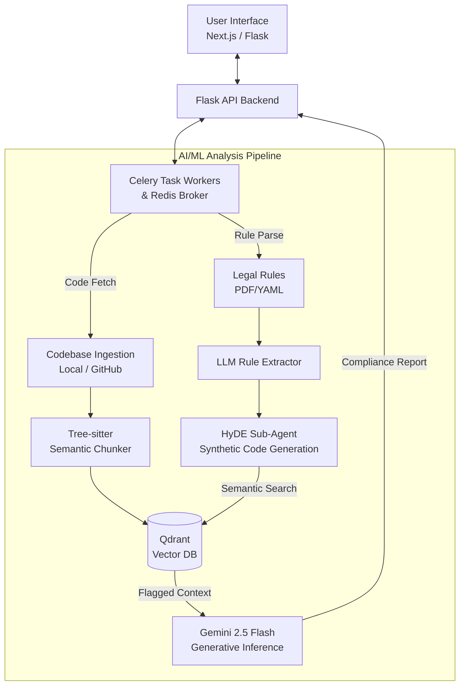

# Software Engineering Lab - Release 2 Project Proposal

## 1. OVERVIEW & PURPOSE
This document serves as the official submission guideline for Release 2 of the Software Engineering Lab project. We are proposing the development of an **AI-Powered Dataset Compliance Checker**. The project is designed to audit codebases and detect dataset license and usage violations using a combination of static analysis, Agentic RAG pipelines, and Google's Gemini 2.5 Flash model. This consolidated document covers the mandatory sections detailing our problem space, proposed solution, and technological approach.

## 2. PROBLEM STATEMENT
As open-source datasets and pre-trained models proliferate, developers often unknowingly violate complex licensing agreements and dataset usage constraints (e.g., restricted commercial use, prohibited generative training). 

Junior and senior developers alike spend countless hours manually cross-referencing legal texts with their codebase implementations. Existing static analysis tools and generic linters lack the semantic understanding required to map verbose, nuanced legal language to functional source code behavior. The absence of context-aware compliance tooling leaves a massive gap that exposes organizations to significant legal liability, copyright infringement, and ethical breaches when models are deployed or datasets are mishandled.

## 3. PROPOSED SOLUTION
We propose building an **AI-Powered Dataset Compliance Checker**, a sophisticated compliance scanning tool that bridges the gap between unstructured legal text and application source code.

**What we are building:**
- **Automated Rule Definition:** The system converts complex dataset licenses (via PDFs or YAML configuration) into structured constraints using an LLM-powered extraction pipeline to prevent the loss of legal nuance.
- **Multimodal Code Ingestion:** The tool analyzes local workspaces, uploaded ZIPs, or public GitHub repositories directly.
- **Advanced Agentic RAG Pipeline:** Our system bridges the semantic gap using Hypothetical Document Embeddings (HyDE). A sub-agent synthesizes hypothetical rule-violating code, which is then used to query the codebase vector embeddings for high-accuracy semantic matches.
- **AI-Driven Detection & Reporting:** The pipeline uses Gemini 2.5 Flash to evaluate the flagged snippets and output deterministic, line-by-line feedback explaining why a snippet violates the conditions.

**Why it is novel / better:**
Instead of traditional regex or generic token-matching, our solution translates legal jargon into code semantics and evaluates AST boundaries using Tree-sitter. This minimizes false positives and provides users with actionable remediation context rather than a simple boolean flag.

* **GitHub Repository:** [https://github.com/sahas42/software-tool](https://github.com/sahas42/software-tool) 
* Complete source code, features description, architecture, `requirements.txt`, setup steps, and comments are already included and actively maintained in the repository's `README.md` and codebase directories.

## 4. SYSTEM ARCHITECTURE
Our architecture adopts a containerized microservice design, split into three main layers:

- **Frontend Layer:** A modern Next.js web application for managing audits alongside a lightweight vanilla Flask-based UI fallback.
- **Backend API & Task Broker:** A Flask API gateway utilizing Celery and Redis. This layer orchestrates asynchronous analysis jobs, ensuring the web client remains unblocked during heavy inference.
- **AI/ML Analysis Pipeline:** The core engine utilizing Tree-sitter for semantic code chunking. Extracted chunks are stored in a local Qdrant Vector database. The pipeline leverages a HyDE (Hypothetical Document Embeddings) sub-agent and Google Gemini 2.5 Flash for the final structured generative inference.

**System Layout Diagram:**

## 5. TECH STACK
- **Frontend:** Next.js (React) for the rich, modern web interface; vanilla HTML/CSS/JS for the lightweight UI fallback.
- **Backend:** Python alongside the Flask framework serving as the REST API gateway and orchestrator.
- **Task Scheduling / Concurrency:** Celery for asynchronous background task execution, backed by Redis acting as the message broker.
- **Database (Vector Store):** Qdrant (deployed locally via Docker) for robust indexing and semantic search over code embeddings.
- **AI / ML:** Google Gemini 2.5 Flash via API (for extraction, reasoning, and context-aware static code analysis); Tree-sitter for semantic abstract syntax tree (AST) codebase chunking; Jina/BGE equivalent variants for text embedding.
- **DevOps / Collaboration:** Docker and Docker Compose for infrastructure orchestration and seamless local provisioning; Git/GitHub for version control.

**Collaboration & Task Tracking Note:** 
During the second half of the course, **GitHub Issues** were actively utilized for formal task tracking and task assignments. Routine team collaboration and communication were handled primarily via **WhatsApp group chats**. Historical logs of these WhatsApp chats have been previously shared in the course Discord group and can be re-supplied upon request.

## 6. CONTRIBUTIONS

### Sahasvat

**Overall Contributions:**
- **Total Project Output:** Personally authored and pushed **60+ commits** to the codebase, serving as the primary developer for the AI pipeline, and contributions and merges across the entire stack. Also the primary maintainer of documentation, project deliverables, and presentations, and a primary coordinator for the project.
- **Core Architecture & Agentic RAG:** Authored initial modular MVP (Gemini, CLI, Pydantic). Developed the Advanced Agentic RAG Pipeline with a HyDE (Hypothetical Document Embeddings) sub-agent strategy to dramatically enhance semantic vector retrieval accuracy.
- **Semantic Code Chunking:** Integrated Tree-sitter to parse Python ASTs, replacing naive text splitters with structurally meaningful code chunk boundaries.
- **Complex Codebase Integrations & Merges:** Resolved substantial structural deviations by executing a complex, multi-branch architectural merge—namely integrating the Tree-Sitter semantic chunker cohesively into the distributed Qdrant vector store branch. Reviewed and merged multiple other PRs.
- **Pipeline Extensibility:** Shipped structural support for mapping remote GitHub repositories directly into the pipeline context. Exclusively authored the advanced PDF rule analyzer leveraging LLMs to isolate complex legal clauses visually outperforming standard text extractors.
- **Research & Project Coordination:** Evaluated 12+ embedding models through robust literature reviews. Handled task allocations via GitHub issues, executed core cross-branch code reviews, curated the Prompt history DB, formulated structural system diagrams, and spearheaded/primary lead the core project deliverables:
  - **Release 2 Project Proposal & SRS v2 (sole author):** Formalized the complete system blueprints and deployment boundaries.
  - **Phase 1 & Release 2 Project Reports (sole author of common parts of latter):** Consolidated designs and weekly progressions into submission documents.
  - **Phase 2 Timeline and Goals (sole creator)**
  - **Codebase Architecture Documentation:** Overhauled infrastructure docs to accurately depict 50+ architectural commits.
  - **Proposal for Phase 1**
  - **Infeasibility report for initial cryptographic approach**
  - **Slide deck creation for demo**
- **Further coordination:** -
  - Organized multiple team meets to discuss project progress and next steps, and conveyed meeting minutes to students who skipped meetings.
  

**Weekly Task Breakdown (More in-depth contributions):**
- **Before 24/02:** Proposed multiple ideas for the project and finalized the idea with the team and sir. Proposed meet with Dr Varsha to discuss feasibility of project, and concluded infeasibility of cryptographic approach. 
- **03/03:** Engineered the initial CLI MVP (Gemini + Pydantic) with mock datasets. Analyzed research literature resolving project novelty. Formalized the core RAG strategy and ideated the VS Code extension concept.
- **10/03:** Finalized a 9-hour certification in RAG architecture. Configured initial `gitingest` and PyPDF integration frameworks. Shipped the first set of functional features enabling remote GitHub repository scraping and analysis.
- **17/03:** Standardized `pyproject.toml` dependencies. Drafted codebase local caching with robust metadata tracking. Championed transition towards code-specific chunking and embedding models over plain-text. Initiated bridging the RAG chain functionally into the web application scope.
- **24/03:** Successfully wired both the standard Vanilla Pydantic and Advanced RAG pipelines to the web interface. Tracked `Lax_commits` branch for relevance-filtering integration and authored the main Phase 1 Submission Report.
- **31/03:** Formulated work assignments and task-splitting via GitHub issues. Reviewed 5 papers on 12+ text-embedding models securely choosing optimal setups. Integrated chosen code-embedding models natively into pipeline routing backed by UI-level toggles.
- **07/04:** Delivered 8 commits releasing: **1.** Entire HyDE generation strategy (backend, UI toggles, tests); **2.** Tree-sitter semantic AST chunking algorithms. Navigated the complex integration natively wiring semantic chunking with Prathamesh's Qdrant vector database. Authored Slide 4 for presentations.
- **14/04:** Executed critical high-level code evaluations spanning pending Redis & Celery background-queue branches. Overhauled systemic constraints entirely from scratch authoring the defining Release 2 SRS and the updated Release 2 Project Proposal.
- **21/04:** Built out and finalized the pipeline layer for the advanced PDF rule analyzer. Safeguarded the application by comprehensively reviewing and executing the high-conflict merge of asynchronous Redis/Celery components into `main`. Drafted the comprehensive Project Report and aggregated 50+ commit-worth of architectural documentation.

### Prathamesh

- **Architectural Design & Strategy**:
    - **High-Level Design (HLD)**: I authored the initial HLD and utilized Mermaid to visualize the data flow, providing a blueprint for the entire team.
    - **Strategic Planning**: I led the decision to shift toward open-source Hugging Face models and specialized code-embedding tools to overcome token limits and cost constraints associated with proprietary APIs.
    - **Workflow Definitions**: I established the process for handling dataset rules, moving from static files to a dynamic system that converts PDF licenses into searchable vector bases.

- **Infrastructure and Data Persistence**:
    - **Vector Database Migration**:I spearheaded the migration from ChromaDB to Qdrant. This moved the project from an in-memory setup to a managed, distributed database, ensuring data persists across server restarts.
    - **Incremental Indexing Engine**:I developed the IncrementalVectorStore class using SHA-256 hashing. This logic ensures the system only embeds new or modified files, drastically reducing processing time and computational waste for subsequent audits.
    - **Environment Management**:I managed the dependency lifecycle, updating configuration files to support the transition to distributed vector clients.

- **COre Logic and Refactoring**:
    - **Pipeline Optimization**: I refactored the analyze_advanced core logic to support repo_id tracking, allowing the system to maintain distinct, persistent collections for different GitHub repositories.
    - **Unified Utilities**: I migrated standalone scripts, such as the rules parser, to the Qdrant backend to ensure architectural consistency across the entire ecosystem.

- **Technical Review and Research**:
     **Advanced Implementation**: I moved from studying fundamental RAG concepts to implementing complex features like similarity metrics and distributed database management.

*My weekly breakdown is available in the Weekly Analysis Report.*

### Vinay Sai
# Weekly Work Summary

## Core Architecture
- Switched to FastAPI + Celery for async processing  
- Added Redis (task queue) and Qdrant (vector DB)  
- Replaced Chroma with Qdrant for incremental indexing (faster scans)  

## Backend & Logic
- Fixed critical bug in `worker.py` (positional argument issue)  
- Moved violation schema (fixed zero violation bug)  
- Improved WebSocket handling (show crashes instead of freezing)  
- Added `verify_acep.py` for quick testing  
- Integrated Tree-sitter for Python AST parsing  

## AI & Performance
- Optimized AI setup for Windows (eager attention + lazy loading)  
- Reduced load time and improved responsiveness  
- Added 2s delay between rule checks (avoid API rate limits)  

## Frontend & UX
- Initially migrated to Next.js + TypeScript  
- Implemented WebSockets for live progress updates  
- Later reverted to simple HTML/CSS/JS (better UI clarity)  
- Added buttons: cancel, retry, new audit  
- Instant cancel resets UI without waiting  
- Improved real-time status feedback  
- Added floating icons (file, search, lock, correct/incorrect)  
- Supported inputs: link, zip, file upload  

## System Design & Discussions
- Finalized pipeline design with team  
- Defined input methods and flow  
- Discussed multi-agent toggle (beyond Gemini)  

## Codebase & Maintenance
- Removed ~7000 lines of unused frontend code  
- Improved repo structure and readability  
- Reviewed team commits  

## Research & Learning
- Learned RAG basics with LangChain  
- Studied pipeline: ingestion → chunking → embeddings → vector DB → retrieval  
- Explored filtering relevant/irrelevant files  
- Researched auto-generating `rules.yaml` from datasets  

## Documentation
- Documented project purpose and tech stack

detailed work done per week was clearly mentioned in the wsl sheet.

## 7. AI USAGE DECLARATION

### Sahasvat

- **Architecture & Planning:** I manually defined most of the system design, using AI purely to validate and refine my instincts.
- **Code Generation:** Code was scaffolded using generative AI via strictly orchestrated, detailed prompts.
- **Quality Assurance:** Every line of my AI-crafted code was rigorously reviewed to prevent and fix unintended behavior.
- **Research:** Leveraged LLMs to break down and understand unfamiliar code snippets.

*My workflow reflects responsible AI usage: automating boilerplate to focus on high-level engineering, rather than blindly relying on AI outputs.*

### Prathamesh

- I used AI somewhat to create a basic structure of code and then modified it with my taste like the embedding model which was used, the text chunking spilt size, the type of vector base used to store, etc…
- I referred to GPT and Gemini to help in some places where I was stuck.
- I take the full accountability for the code generated through me using LLMs.

### Vinay Sai
- I used ai to kind of make a quick prototype of what i was thinking and i tried to improve it step by step . architecture, design and flow was clearly mentioned to the ai and code generation was done by ai.(antigrvity)
- Design ideas and unknown technologies , terminologies were carefully reasearched by me through chatgpt or gemini.
- I take the full accountability for the code generated through me using LLMs.

## 8. PROMPTS

### Sahasvat

Please find the link to my chats here: https://drive.google.com/drive/folders/1iPlRRQo2XlbHTwvBJRHeUMXurdeWuAvA?usp=sharing 

### Prathamesh

*I have included the major prompts which reflects the overall and most relevant use of LLMs in the project from my part:*
- https://gemini.google.com/share/f9a86c06bf12 
- https://gemini.google.com/share/5bd0ee644345 
- https://chatgpt.com/share/69b9068a-a52c-8009-b927-63931c56a6fe

  ### Vinay sai
  *These are my chats with antigravity:
  - https://gist.github.com/VinaySai-GH/74e2193c3e9096b2efe0baa44b977c59
  - https://gist.github.com/VinaySai-GH/f9b788c73730284a2b6f23bf509056e7
  
  additionally, another chat in antigravity got deleted automatically due to a bug.

## 9. PROJECT DOCUMENTATION

*For comprehensive technical specifications, API schemas, design decisions, and system blueprints, please refer to the global documentation files housed within the project repository:*

- [Main Project README](https://github.com/sahas42/software-tool/blob/main/README.md)
- [System Architecture](https://github.com/sahas42/software-tool/blob/main/ARCHITECTURE.md)
- [API & Models Requirements](https://github.com/sahas42/software-tool/blob/main/docs-and-plans/API_AND_MODELS.md)
- [File-by-File Breakdown](https://github.com/sahas42/software-tool/blob/main/docs-and-plans/FILE_BY_FILE_BREAKDOWN.md)
- [Flask Integration Report](https://github.com/sahas42/software-tool/blob/main/docs-and-plans/FLASK_INTEGRATION_REPORT.md)
- [Modules & Dependencies](https://github.com/sahas42/software-tool/blob/main/docs-and-plans/MODULES_AND_DEPENDENCIES.md)
- [SOTA Code Embedding Models Report](https://github.com/sahas42/software-tool/blob/main/literature-review/SOTA_Code_Embedding_Models_Report.md)
