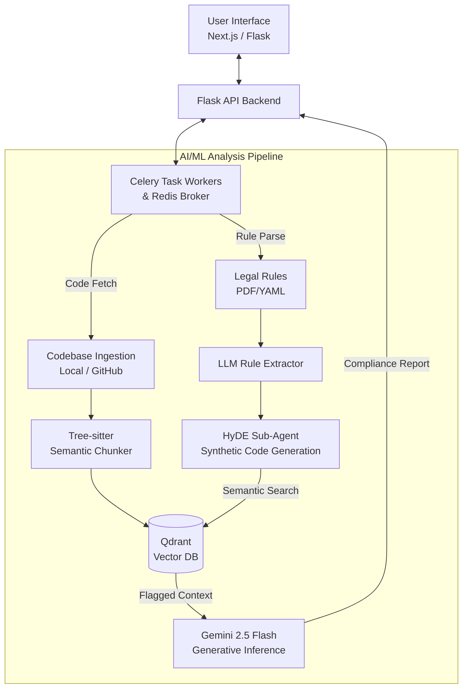

# Software Engineering Lab - Release 2 Project Proposal

## 1. OVERVIEW & PURPOSE
This document serves as the official submission guideline for Release 2 of the Software Engineering Lab project. We are proposing the development of an **AI-Powered Dataset Compliance Checker**. The project is designed to audit codebases and detect dataset license and usage violations using a combination of static analysis, Agentic RAG pipelines, and Google's Gemini 2.5 Flash model. This consolidated document covers the mandatory sections detailing our problem space, proposed solution, and technological approach.

## 2. PROBLEM STATEMENT
As open-source datasets and pre-trained models proliferate, developers often unknowingly violate complex licensing agreements and dataset usage constraints (e.g., restricted commercial use, prohibited generative training). 

Junior and senior developers alike spend countless hours manually cross-referencing legal texts with their codebase implementations. Existing static analysis tools and generic linters lack the semantic understanding required to map verbose, nuanced legal language to functional source code behavior. The absence of context-aware compliance tooling leaves a massive gap that exposes organizations to significant legal liability, copyright infringement, and ethical breaches when models are deployed or datasets are mishandled.

## 3. PROPOSED SOLUTION
We propose building an **AI-Powered Dataset Compliance Checker**, a sophisticated compliance scanning tool that bridges the gap between unstructured legal text and application source code.

**What we are building:**
- **Automated Rule Definition:** The system converts complex dataset licenses (via PDFs or YAML configuration) into structured constraints using an LLM-powered extraction pipeline to prevent the loss of legal nuance.
- **Multimodal Code Ingestion:** The tool analyzes local workspaces, uploaded ZIPs, or public GitHub repositories directly.
- **Advanced Agentic RAG Pipeline:** Our system bridges the semantic gap using Hypothetical Document Embeddings (HyDE). A sub-agent synthesizes hypothetical rule-violating code, which is then used to query the codebase vector embeddings for high-accuracy semantic matches.
- **AI-Driven Detection & Reporting:** The pipeline uses Gemini 2.5 Flash to evaluate the flagged snippets and output deterministic, line-by-line feedback explaining why a snippet violates the conditions.

**Why it is novel / better:**
Instead of traditional regex or generic token-matching, our solution translates legal jargon into code semantics and evaluates AST boundaries using Tree-sitter. This minimizes false positives and provides users with actionable remediation context rather than a simple boolean flag.

* **GitHub Repository:** [https://github.com/sahas42/software-tool](https://github.com/sahas42/software-tool) 
* Complete source code, features description, architecture, `requirements.txt`, setup steps, and comments are already included and actively maintained in the repository's `README.md` and codebase directories.

## 4. SYSTEM ARCHITECTURE
Our architecture adopts a containerized microservice design, split into three main layers:

- **Frontend Layer:** A modern Next.js web application for managing audits alongside a lightweight vanilla Flask-based UI fallback.
- **Backend API & Task Broker:** A Flask API gateway utilizing Celery and Redis. This layer orchestrates asynchronous analysis jobs, ensuring the web client remains unblocked during heavy inference.
- **AI/ML Analysis Pipeline:** The core engine utilizing Tree-sitter for semantic code chunking. Extracted chunks are stored in a local Qdrant Vector database. The pipeline leverages a HyDE (Hypothetical Document Embeddings) sub-agent and Google Gemini 2.5 Flash for the final structured generative inference.

**System Layout Diagram:**

## 5. TECH STACK
- **Frontend:** Next.js (React) for the rich, modern web interface; vanilla HTML/CSS/JS for the lightweight UI fallback.
- **Backend:** Python alongside the Flask framework serving as the REST API gateway and orchestrator.
- **Task Scheduling / Concurrency:** Celery for asynchronous background task execution, backed by Redis acting as the message broker.
- **Database (Vector Store):** Qdrant (deployed locally via Docker) for robust indexing and semantic search over code embeddings.
- **AI / ML:** Google Gemini 2.5 Flash via API (for extraction, reasoning, and context-aware static code analysis); Tree-sitter for semantic abstract syntax tree (AST) codebase chunking; Jina/BGE equivalent variants for text embedding.
- **DevOps / Collaboration:** Docker and Docker Compose for infrastructure orchestration and seamless local provisioning; Git/GitHub for version control.

## 6. CONTRIBUTIONS

### Sahasvat

**Overall Contributions:**
- **Core Architecture & Agentic RAG:** Sole author of the initial modular MVP (using Gemini, CLI, and Pydantic schemas). Designed and implemented the Advanced Agentic RAG Pipeline with a HyDE (Hypothetical Document Embeddings) sub-agent strategy to dramatically enhance semantic vector retrieval accuracy.
- **Semantic Code Chunking:** Integrated Tree-sitter to parse Python ASTs, replacing naive character splitters with structurally meaningful code chunk boundaries (functions, classes).
- **Rule Extraction:** Developed an advanced PDF rule analyzer to extract multifaceted, complex legal compliance clauses precisely via LLMs.
- **Input Ingestion & Pipeline Delivery:** Enabled remote repository compliance audits by integrating `gitingest`. Successfully exposed both the vanilla and RAG pipelines to the web application interface.
- **Research & Project Coordination:** Executed rigorous literature reviews evaluating 12+ embedding models. Drove project momentum by structuring tasks via GitHub issues and conducting comprehensive cross-team code reviews. To establish the system design, I also spearheaded the following core project deliverables:
  - **Release 2 System Requirements Specification (SRS v2):** Detailed system constraints, models, and pipeline transitions.
  - **Release 2 Project Proposal:** Formally defined the new architecture and integration boundaries based on instructor feedback.
  - **Phase 1 Submission Report:** Consolidated initial designs and workflows into a formal coursework report.
  - **Codebase Architecture Documentation:** Overhauled project setup documentation to precisely reflect the last 50+ backend commits.
  - **Project Presentation Slide Deck:** Authored core architectural slides and provided feedback to unify the presentation.

**Weekly Task Breakdown:**
- **03/03:** Built the bare-minimal functional MVP CLI tool using Gemini and Pydantic. Reviewed literature to validate project novelty, and formally proposed the RAG architecture solution.
- **10/03:** Up-skilled via a 9-hour RAG certification. Authored the initial architectural draft leveraging `gitingest` and PyPDF. Shipped code for analyzing remote GitHub repositories rather than just local directories.
- **17/03:** Shipped codebase download logic for repositories. Outlined the RAG strategy transition, explicitly championing AST/code-specific chunking models over generic language chunkers. Standardized project dependencies.
- **24/03:** Wired the Vanilla Gemini-Pydantic pipeline alongside the iterative RAG pipeline to the initial frontend web interface. Authored the Phase 1 Submission Report.
- **31/03:** Split workloads strategically via GitHub issues. Conducted an extensive literature review (5+ papers, 12+ models) to isolate the most optimal code embedding models. Integrated the selected embedding models natively into the pipeline, complete with a UI toggle.
- **07/04:** Delivered 8 critical commits launching two major infrastructural modules: **1.** The HyDE Sub-agent (including backend logic, tests, and UI toggles). **2.** Tree-sitter Semantic Chunking logic for rigorous code segmentation. Also prepared the final project presentation slide deck.
- **14/04:** Reviewed and validated backend Redis/Celery changes. Exclusively authored a major structural Proposal rewrite for Release 2 based on instructor feedback. Exclusively drafted the System Requirements Specification (SRS) mapping out Release 2.
- **21/04:** Commenced and finished the advanced PDF rule analyzer module. Merged the Celery/Redis asynchronous workers to `main`. Overhauled project documentation mapping 50+ commits, compiled prompt histories for grading transparency, and generated the formal Release 2 Project Report.

### Prathamesh

## 7. AI USAGE DECLARATION

### Sahasvat

- **Architecture & Planning:** I manually defined most of the system design, using AI purely to validate and refine my instincts.
- **Code Generation:** Code was scaffolded using generative AI via strictly orchestrated, detailed prompts.
- **Quality Assurance:** Every line of my AI-crafted code was rigorously reviewed to prevent and fix unintended behavior.
- **Research:** Leveraged LLMs to break down and understand unfamiliar code snippets.

*My workflow reflects responsible AI usage: automating boilerplate to focus on high-level engineering, rather than blindly relying on AI outputs.*

### Prathamesh

## 8. PROMPTS

### Sahasvat

Please find links to my chats here: https://drive.google.com/drive/folders/1iPlRRQo2XlbHTwvBJRHeUMXurdeWuAvA?usp=sharing 

### Prathamesh

## 9. PROJECT DOCUMENTATION

*For comprehensive technical specifications, API schemas, design decisions, and system blueprints, please refer to the global documentation files housed within the project repository:*

- [Main Project README](https://github.com/sahas42/software-tool/blob/main/README.md)
- [System Architecture](https://github.com/sahas42/software-tool/blob/main/ARCHITECTURE.md)
- [API & Models Requirements](https://github.com/sahas42/software-tool/blob/main/docs-and-plans/API_AND_MODELS.md)
- [File-by-File Breakdown](https://github.com/sahas42/software-tool/blob/main/docs-and-plans/FILE_BY_FILE_BREAKDOWN.md)
- [Flask Integration Report](https://github.com/sahas42/software-tool/blob/main/docs-and-plans/FLASK_INTEGRATION_REPORT.md)
- [Modules & Dependencies](https://github.com/sahas42/software-tool/blob/main/docs-and-plans/MODULES_AND_DEPENDENCIES.md)
- [SOTA Code Embedding Models Report](https://github.com/sahas42/software-tool/blob/main/literature-review/SOTA_Code_Embedding_Models_Report.md)
